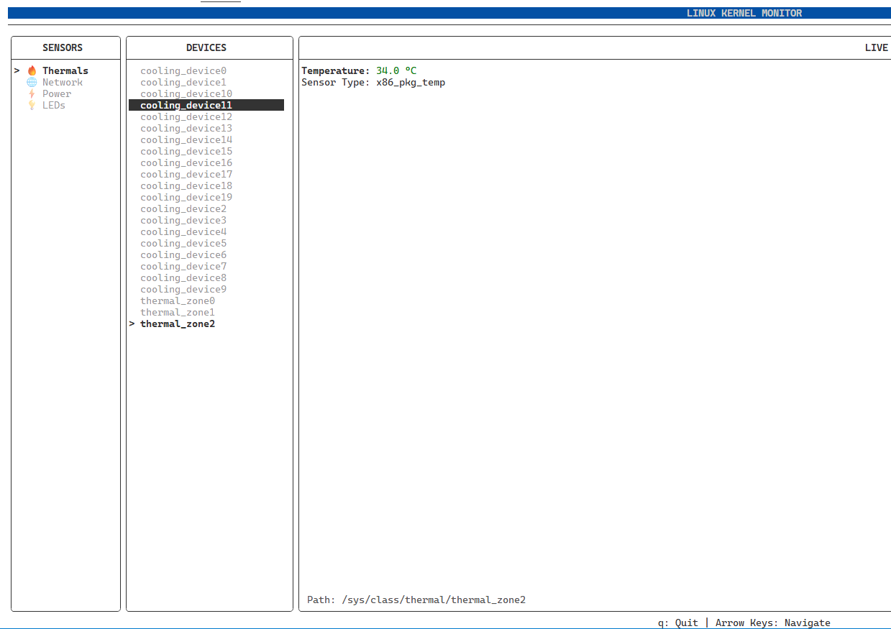

# Linux Kernel Map TUI (`kmap`)


A high-performance terminal utility for exploring the Linux `sysfs` kernel interface. It visualizes hardware hierarchies and provides real-time sensor monitoring (Thermal, Network, Power) entirely in **user-space**, ensuring safe deployment without requiring elevated privileges.


*(Note: Add a screenshot of your TUI here after your first build)*

## 🚀 Why this tool?

While generic file managers like `ranger` treat kernel files as raw text, and monitoring tools like `htop` are hardcoded to specific metrics, **`kmap`** bridges the gap. It serves as a "smart explorer" for the Linux driver model, allowing engineers to:

* **Explore:** Traverse the `/sys/class` hierarchy to understand device topology.
* **Visualize:** Automatically detect sensor files and render them as real-time graphs (Sparklines/Gauges) instead of raw integer streams.
* **Debug:** Inspect hardware states (links, power, thermal zones) without requiring root access.

## 🛠️ Tech Stack

* **Language:** C++17
* **Build System:** CMake (FetchContent)
* **UI Library:** [FTXUI](https://github.com/ArthurSonzogni/FTXUI) (Functional Terminal User Interface)
* **Key Concepts:**
    * `std::filesystem` for efficient directory traversal.
    * `std::thread` / `std::atomic` for non-blocking sensor polling.
    * Event-driven TUI rendering.

## 📦 Installation & Build

This project uses **CMake** and handles dependencies automatically.

### Prerequisites
* Linux (Ubuntu/Debian recommended)
* C++ Compiler (GCC 9+ or Clang)
* CMake 3.11+

### Build Steps
```bash
# 1. Clone the repository
git clone [https://github.com/YOUR_USERNAME/linux-kernel-map-tui.git](https://github.com/YOUR_USERNAME/linux-kernel-map-tui.git)
cd linux-kernel-map-tui

# 2. Create build directory
mkdir build && cd build

# 3. Configure and Build (Release mode recommended for performance)
cmake -DCMAKE_BUILD_TYPE=Release ..
make -j4

# 4. Run
./kmap

##🗺️ Roadmap* [x] **v0.1.0:** Basic directory traversal of `/sys/class` using `std::filesystem`.
* [ ] **v0.2.0:** Real-time sparkline graphs for integer-based sensors (thermal/power).
* [ ] **v0.3.0:** Context-aware labeling (e.g., mapping `thermal_zone2` -> "CPU Package").
* [ ] **v1.0.0:** Search functionality and dashboard view.

##📄 LicenseThis project is licensed under the MIT License - see the [LICENSE](https://www.google.com/search?q=LICENSE) file for details.